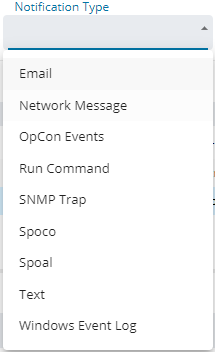

# Notification Triggers

Available Notification Triggers in OpCon are shown in the following Grid under Library -> Notification Triggers.

Clicking the **Add** button or **Selecting a record in the grid** will enable the bottom panel:

:::note
The **Group Name** - **Trigger Name** combination must be unique when adding a notification trigger.
:::

**Description**: This option allows you to provide a description and
purpose for the notification triggers to be sent.

**Include Internal Job Number in Job Name frame**: This option
    determines whether the job name included in the Prefix Information
    for the notification message will be unique each time a notification
    is processed. The unique job name comprises the original job name
    and a unique SAM-generated job number.

**Escalation Rule**: This option specifies the optional escalation rule to apply to an email notification. By default, this drop-down list and search function are hidden and only become visible if the trigger has an email notification checkbox is selected.

The bottom panel provides options for configuring notification types. The following **Notification Types** are provided: Email, Text Notification, OpCon Events, Windows Event Log, Network Notification, SNMP Trap, Run Command and SPO Event Report.

The **Add** button will allow you to a new notification for the selected trigger.

The **Edit** button will allow you to edit an existing notification for the selected trigger.

The **Delete** will allow you to remove an existing notification.

**Active/Inactive Notification Status**: The toggle button to the left of each notification type indicates the *Active*  or
    *Inactive*  status for each type of notification. By default,
    the toggle button is not visible. You can click toggle button to toggle
    the status from *Active* to *Inactive*.

:::note
    Modifications will take effect only after clicking on the Save button.
:::

Click on any of the following quick links to access the instructions on
how to define and send that notification type:

- [Send Email (SMTP)](./NotificationTypes/Email)
- [Send Short Text Message](./NotificationTypes/Text-Message)
- [Send OpCon Events](./NotificationTypes/OpCon-Events)
- [Send Windows Event Log](./NotificationTypes/Windows-Event-Log)
- [Send Network Message](./NotificationTypes/Network-Message)
- [Send SNMP Trap](./NotificationTypes/SNMP-Trap)
- [Send SPO Event Report](./NotificationTypes/SPO-Event-Report)
- [Run Command](./NotificationTypes/Run-Command)

**Lookup Dialog** To conduct the reverse look up of an event, you will need to have the Notification ID. You can obtain the Notification ID (when available) from a notification message or retrieve the Notification ID from the SMANotifyHandler.log.

Clicking on the  button will open the Lookup dialog 

- [Lookup Dialog](./NotificationTypes/Looking-up-Notification-Sources)

Clicking on the  button will open the copy dialog
- [Copy Dialog](./NotificationTypes/Copy-Notification-Trigger)

**Advanced Filtering** To perform advanced filtering of the notification triggers, use the Advanced Filters located at the top right of the screen.

Filtering by **Contents** will filter by showing the notification triggers which contain the specified text in any of the notifications.

Filtering by **Notification Type** will filter by showing the notification triggers that have all of the selected notification types from the selection drop down configured.

Filtering by **Categories** will filter by showing the notification triggers that are associated with all of the selected categories in the selection drop down.

:::note
For customers who migrated from versions previous to 21.6, the way to reach a specific notification group using Enterprise Manager is by selecting the main parent group and then each subsequent group in the tree until the desired group was found. After the migration and using Solution Manager, the user will need to use the categories filter and select the categories corresponding to the parent group name, this migration is backwards compatible so users will still be able to use Notification Manager in EM
:::

**Using Enterprise Manager**

**Using Solution Manager**

